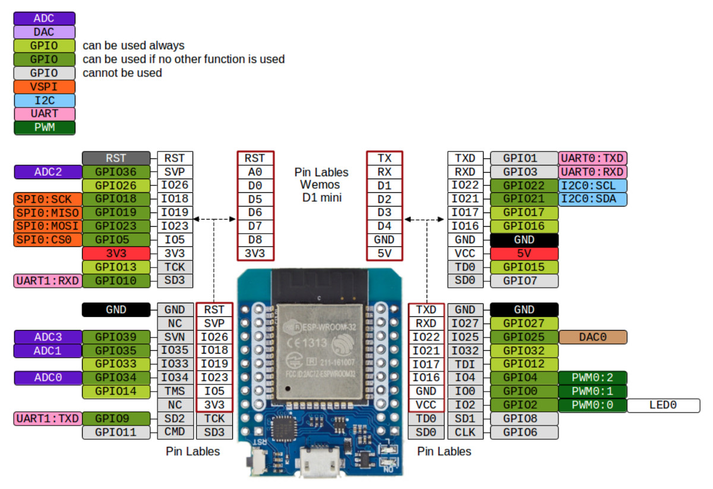
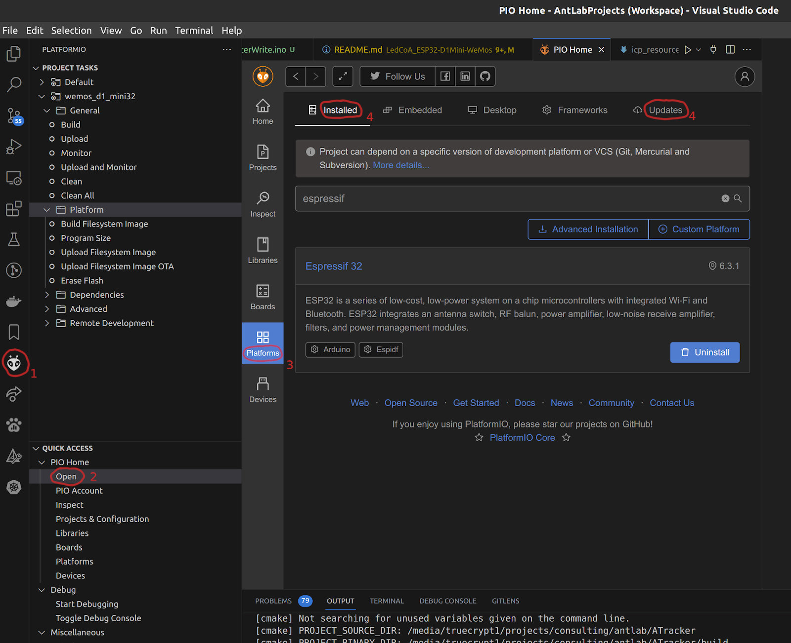

# LedCoA_ESP32 - LED Strips Control Automation via 2x ESP32 D1Mini WeMos DevBoards
This application controls up to 4 LED strips from 2 synchronized ESP32 D1Mini WeMos DevBoards using 2 DACs on each board. In addition, it senses photodiodes corresponding to each of the LED strips and synchronizes LED strips blinking with the [Euresys Coaxlink Grabber (Coaxlink Quad G3, KQG13496)](https://www.euresys.com/en/Products/Frame-Grabbers/Coaxlink-series/Coaxlink-Quad-G3) that captures frames from the cameras, whose lighting is provisioned by the LED strips.

**Table of Contents**
- [Hardware documentation and drivers:](#hardware-documentation-and-drivers)
- [Build](#build)
- [Usage](#usage)
  - [Control Commands](#control-commands)
    - [Inspection and Manual Control via the Terminal](#inspection-and-manual-control-via-the-terminal)
    - [Command Specification](#command-specification)
  - [Minicom for UART Reading](#minicom-for-uart-reading)
- [ESP32 Port Mapping](#esp32-port-mapping)
  - [#1 D1 Mini ESP32 WeMos](#1-d1-mini-esp32-wemos)
  - [#2 D1 Mini ESP32 WeMos](#2-d1-mini-esp32-wemos)

## Hardware documentation and drivers:
- [ESP32 tutorials](https://dronebotworkshop.com/esp32-2/)
- [Euresys Coaxlink Grabber (Coaxlink Quad G3) documentation and drivers](https://www.euresys.com/en/Support/Download-area?Series=105d06c5-6ad9-42ff-b7ce-622585ce607f)

ESP32 Pinout:



## Build

Use the [PlatformIO IDE (PIO)](https://platformio.org/install/ide) extension of the [Visual Studio Code IDE](https://code.visualstudio.com/) to build and flash the firmware to ESP32 D1Mini WeMos DevBoards. `espressif32` platform should be _installed_ or _updated_ (the original build is performed in `espressif32@6.3`) in the PIO as shown in the following image.

> If several `espressif32` versions are installed, then it might be necessary to uninstall them or even remove them manually:
    ```sh
    $ rm -rf /home/lav/.platformio/packages/framework-arduinoespressif32
    ```


Depending on whether you build the firmware for the __master__ or __slave__ board, it is necessary to (un)comment the respective macro definition at the top of `main.cpp`:
```c++
#define BOARD_MASTER  // Should be specified only for the master board build
```
> That approach of the explicit macro definition is necessary to explicitly and permanently define a _master/slave_ board rather than defining the board role in the run-time (e.g., the first board attached to the I2C becomes slave and the other one becomes master).
A user expects permanent role of the board rather than the one defined by the booting order.


Use the _PlatformIO: Build_ command (`Ctrl + Alt + B`) to build the firmware.

Use the _PlatformIO: Upload_ command ( `Ctrl + Alt + U`) to flash the target board connected via _USB data cable_, specifying the target USB port in the `platformio.ini` if necessary.
> The available USB ports having active devices (serial connections) can be listed as follows.
> ```sh
> $ ls /dev/ttyUSB*
> /dev/ttyUSB0  /dev/ttyUSB1
> ```

## Usage

ESP32 Boards are controllable via the UART (Serial port) from the host PC using the commands specified in this section. Those commands allow ESP32 boards to manage our custom ligting box (manage LED strips and interact with photodiodes) and emit triggering signal to the Euresys Coaxlink Camera Grabber (trigger connected cameras). Those edge devices (LED strips, photodiodes, and grabber) should be wired to the ESP32 boards as specified in the [ESP32 Port Mapping](#esp32-port-mapping) section.

### Inspection and Manual Control via the Terminal

Use minicom (see its [configuration below](#minicom-for-uart-reading)) or another application to read from the UART output of the master (or slave) board.

Connect to the master board (you can list available USB devices by `$ ls /dev/ttyUSB*`; we assume that the master board on `ttyUSB0`):
```sh
$ minicom -D /dev/ttyUSB0
Input the control command (<ctl: uint8_t> <value: uint8_t>)
```

Open another terminal to send control signals (see [Control commands](#control-commands)) to the master board:
```
echo -ne "\x7\xAA" > /dev/ttyUSB0
```
This signal immediately sets brightness of 3 LED strips (`0x07`) to the intensity value 67% (`0xAA` = 170 of 255 = 61.6% = ~2.03V of 0.08..3.3V). The binary representation of this command is
```txt
  1st byte 0x07     2nd byte 0xAA
|0|0|0|0|0|1|1|1| |1|0|1|0|1|0|1|0|
 7 6 5 4 3 2 1 0   7 6 5 4 3 2 1 0 
```
see the [Command Specification](#command-specification) section for details.

Then you should see in the first terminal via the minicom that  
- 01=0x1 mask (0x07 >> 2 = 0x01 = 01b) with 0xAA value is transferred to the Slave and
- 0x03 (0x07 & 0x3 = 0x3 = 011b) with 0xAA value is applied on the Master ESP32 board:
```
Transferring to wire (idMask2, intensity): 0X1 0XAA
LED strips id (mask): 0X3
Set intensity: 0XAA
```

To _exit from the minicom (which is mandatory before the reflashing)_, press `Ctrl+A X` and select `Yes` by pressing `Enter`.

### Control Commands

Control commands are sent to the _ESP32 master board_ from the host PC via a serial port (USB UART), which automatically propagates them to the slave board.  
> The slave board also accepts commands via UART, but it cannot propagate them to the master board or initiate communication with the master.

Each command is represented by _2 bytes_ as follows.
```txt
Command bits: |7|6|5|4|3|2|1|0| |7|6|5|4|3|2|1|0|
```

#### Command Specification

<style>
.def td {
  text-align: center;
}

.def td:first-child {
  text-align: left;
  font-weight: bold;
}
</style>
<table id="cmd-spec" class="def">
    <thead>
        <tr>
            <th></th>
            <th colspan=8>1st byte</th>
            <!-- <th></th> -->
            <th colspan=8>2nd byte</th>
        </tr>
    </thead>
    <tbody>
        <tr style=":first-child {font-weight: bold}">
            <td>Bit</td>
            <td>7</td>
            <td>6</td>
            <td>5</td>
            <td>4</td>
            <td>3</td>
            <td>2</td>
            <td>1</td>
            <td>0</td>
            <!-- <td></td> -->
            <td>7</td>
            <td>6</td>
            <td>5</td>
            <td>4</td>
            <td>3</td>
            <td>2</td>
            <td>1</td>
            <td>0</td>
        </tr>
        <tr>
            <td>Notation</td>
            <td colspan=4>-</td>
            <td colspan=4>mask</td>
            <!-- <td></td> -->
            <td colspan=8>value</td>
        </tr>
    </tbody>
</table>

Description:
```txt
mask (1.0-3):  required operation
  0001  - Master Board DAC1 (Top IR LED strip)
  0010  - Master Board DAC2 (Middle IR LED strip)
  0100  - Slave Board DAC2 (Middle Fluo LED strip)
  1000  - Slave Board DAC1 (Bottom Fluo LED strip)
value (2.0-7):  brightness intensity of the respective LED strip (0..0xFF -> 0.08..3.3V = 0..100%)
```

### Minicom for UART Reading
Minicom can be installed by the following command:
```sh
$ sudo apt install minicom
```
Then, select the target USB port and listen to it using minicom:
```sh
$ minicom -D /dev/ttyUSB0
```
Configure the opened connection and save it as a default configuration: press `Ctrl+A O`, select `Serial port setup` and ensure the following values:
```
	E - "115200 8N1"
	F - No
```

## ESP32 Port Mapping

\#1 D1 Mini is powered by USB (and, hence, can be externally controlled and re-flashed at any time).  
\#2 D1 Mini can be powered either from your dedicated power supply (3.3V DC) or from 3.3V pin of #1 D1 Mini connected to 3.3V pin (note that VCC pin accepts 5V rather than 3.3V). The ground supply of #2 D1 Mini is GND pin located near its VCC pin.  

D1 Mini boards synchronization can be performed either by I2C (which are IO22=SCL0 and IO21=SDA0 by default; it might be necessary to wire also the grounds of the boards to get I2C work), or by one of the available UARTs (Serial ports), or by any custom 3 pins (e.g., IO33,  IO27, IO32).  

### \#1 D1 Mini ESP32 WeMos (Master)
**2 internal DACs (IO25, IO26) for Analog O/P:**
IO25 (Master DAC1)  <-  1. O/P (Output)  Analog 0…3.3V (0.08 .. 3.3 V)  Channel Top IR Strip (L1)  
IO26 (Master DAC2)  <-  2. O/P  Analog 0…3.3V (0.08 .. 3.3 V)  Channel Middle IR Strip (L2S)  
**O/P  Digital Trigger Pulse OFF is performed from GPIO:**
IO16 (might be updated to IO32)  <- 5. O/P  Digital Trigger Pulse OFF:  0V  Pulse ON:  3.3V  Channel Top IR Strip (L1)  
IO17 (might be updated to IO27)  <- 8. O/P  Digital Trigger Pulse OFF:  0V  Pulse ON:  3.3V  Channel Middle IR Strip (L2S)  
**I/P  Analog 0…3.3V:**
IO34 (PSD1 = VDET_1 = ADC1_6 = Arduino's ADC0)  <- 9. I/P (Input)  Analog 0…3.3V  FB Photo diode Channel Top IR Strip (L1)  
IO35 (VDET_2 = ADC1_7 = Arduino's ADC1)  <- 11. I/P  Analog 0…3.3V  FB Photo diode Channel Middle IR Strip (L2S)  
Alternatively, IO27 (ADC2_7) can be used to read data from 2 distinct ADCs in parallel (ADC1_6 and ADC2_7 ). However, it will load CPU because only ADC1 supports DMA.  

**Internal communication:**
IO21 - I2C_SDA IO/P (Input-Output) Data  
IO22 - I2C_SCL IO/P Clock  
GND - Mutual ground wiring for all I2C devices is required  

IO1 - UART0 TXD Serial Port Transmit Data  
IO3 - UART0 RXD Serial Port Receive Data  
GND - Ground wiring is required for each serial device  
VCC - Power (5V) wiring is required for each serial device  

IO33 - GTL2 O/P firmware-yielding camera's grabber trigger pulse (0..5V, where 2.5..5V is HIGH)  

### \#2 D1 Mini ESP32 WeMos (Slave)
**2 internal DACs (IO25, IO26) for Analog O/P:**
IO25 (Slave DAC1)  <-  3. O/P  Analog 0…3.3V (0.08 .. 3.3 V)  Channel Bottom Fluo Strip (L3U)  
IO26 (Slave DAC2)  <-  4. O/P  Analog 0…3.3V (0.08 .. 3.3 V)  Channel Middle Fluo Strip (L3S)  
**O/P  Digital Trigger Pulse OFF is performed from GPIO:**
IO16 (updating to IO32)  <- 6. O/P  Digital Trigger Pulse OFF:  0V  Pulse ON:  3.3V  Channel Bottom Fluo Strip (L3U)  
IO17 (updating to IO27)  <- 7. O/P  Digital Trigger Pulse OFF:  0V  Pulse ON:  3.3V  Channel Middle Fluo Strip (L3S)  
**I/P  Analog 0…3.3V:**
IO34 (PSD1 = VDET_1 = ADC1_6 = Arduino's ADC0)  <- 9. I/P (Input)  Analog 0…3.3V  FB Photo diode Channel Bottom Fluo Strip (L3U)  
IO35 (VDET_2 = ADC1_7 = Arduino's ADC1)  <- 11. I/P  Analog 0…3.3V  FB Photo diode Channel Middle Fluo Strip (L3S)  
Alternatively, IO27 (ADC2_7) can be used to read data from 2 distinct ADCs in parallel (ADC1_6 and ADC2_7 ). However, it will load CPU because only ADC1 supports DMA.  

**Internal communication:**
IO21 - I2C_SDA IO/P (Input-Output) Data  
IO22 - I2C_SCL IO/P Clock  
GND - Mutual ground wiring for all I2C devices is required  

IO1 - UART0 TXD Serial Port Transmit Data  
IO3 - UART0 RXD Serial Port Receive Data  
GND - Ground wiring is required for each serial device  
VCC - Power (5V) wiring is required for each serial device  

IO33 - GTL1 O/P firmware-yielding camera's grabber trigger pulse (0..5V, where 2.5..5V is HIGH).  
> GTL1 is shared with the Lighting Box, being disabled for the firmware by default.
