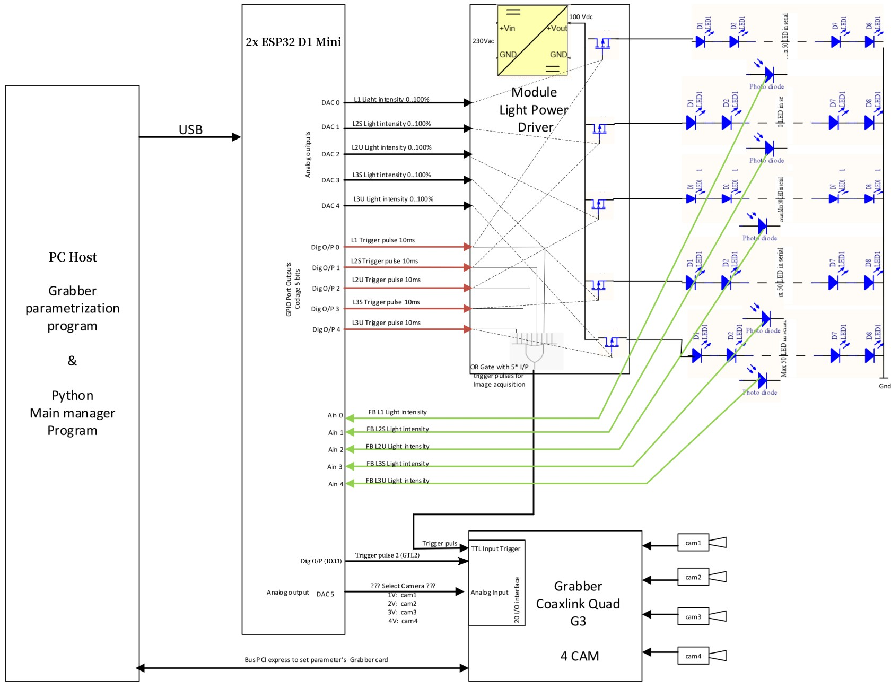

# LedCoA_ESP32 - LED lighting and Camera capturing Automation via 2x ESP32 D1Mini WeMos DevBoards

This firmware receives control signals via the USB serial port, manages our external custom lighting (manages LED strips, interacts with photodiodes), and emits triggering signals to the [Euresys Coaxlink Grabber (Coaxlink Quad G3, KQG13496)](https://www.euresys.com/en/Products/Frame-Grabbers/Coaxlink-series/Coaxlink-Quad-G3) grabber with several cameras.  
The firmware controls the _brightness_ and _blinking frequency_ of up to 4 LED strips using 4 DACs from 2 ESP32 D1Mini WeMos DevBoards. Those boards are automatically synchronized via the I2C bus. Additionally, the firmware _senses photodiodes_ corresponding to each LED strip and synchronizes LEDs blinking with the camera grabber, _emitting the camera triggering signal_ with the specified frequency.

Authors: Artem Lutov &lt;&#108;u&#97;&commat;&#108;ut&#97;n.ch&gt;, Emmanuel Gendre, Adria LeBoeuf &lt;&#97;dri&#97;.&#108;eboe&#117;f&commat;&#117;nifr.ch&gt;   
License: [Apache License, Version 2](www.apache.org/licenses/LICENSE-2.0.html)  
Organizations: [UNIFR](https://www.unifr.ch), [Lutov Analytics](https://lutan.ch/), [LUMAIS](http://lumais.com)


__Table of Contents__
- [Hardware Documentation and Drivers](#hardware-documentation-and-drivers)
- [Build](#build)
- [Usage](#usage)
  - [Inspection and Manual Control via the Terminal](#inspection-and-manual-control-via-the-terminal)
  - [Control Commands](#control-commands)
    - [Command Specification](#command-specification)
  - [Grabber (camera) Triggering](#grabber-camera-triggering)
  - [Latency and Delays](#latency-and-delays)
  - [Minicom for UART Reading](#minicom-for-uart-reading)
- [ESP32 Port Mapping](#esp32-port-mapping)
  - [#1 D1 Mini ESP32 WeMos](#1-d1-mini-esp32-wemos)
  - [#2 D1 Mini ESP32 WeMos](#2-d1-mini-esp32-wemos)
## Hardware Documentation and Drivers
- [ESP32 tutorials](https://dronebotworkshop.com/esp32-2/)
- [Euresys Coaxlink Grabber (Coaxlink Quad G3) documentation and drivers](https://www.euresys.com/en/Support/Download-area?Series=105d06c5-6ad9-42ff-b7ce-622585ce607f)

ESP32 Pinout:


## Build

Use the [PlatformIO IDE (PIO)](https://platformio.org/install/ide) extension of the [Visual Studio Code IDE](https://code.visualstudio.com/) to build and flash the firmware to ESP32 D1Mini WeMos DevBoards. `espressif32` platform should be _installed_ or _updated_ (the original build is performed in `espressif32@6.3`) in the PIO as shown in the following image.

> If several `espressif32` versions are installed, then it might be necessary to uninstall them or even remove them manually:
    ```sh
    $ rm -rf /home/lav/.platformio/packages/framework-arduinoespressif32
    ```


Depending on whether you build the firmware for the __master__ or __slave__ board, it is necessary to (un)comment the respective macro definition at the top of `main.cpp`:
```c++
#define BOARD_MASTER  // Should be specified only for the master board build
```
> That approach of the explicit macro definition is necessary to explicitly and permanently define a _master/slave_ board rather than defining the board role in the run-time (e.g., the first board attached to the I2C becomes slave and the other one becomes master).
A user expects permanent role of the board rather than the one defined by the booting order.


Use the _PlatformIO: Build_ command (`Ctrl + Alt + B`) to build the firmware.

Use the _PlatformIO: Upload_ command ( `Ctrl + Alt + U`) to flash the target board connected via _USB data cable_, specifying the target USB port in the `platformio.ini` if necessary.
> The available USB ports having active devices (serial connections) can be listed as follows.
> ```sh
> $ ls /dev/ttyUSB*
> /dev/ttyUSB0  /dev/ttyUSB1
> ```

## Usage

ESP32 Boards are controllable via the UART (Serial port) from the host PC using the commands specified in this section. Those commands allow ESP32 boards to manage our custom ligting box (manage LED strips and interact with photodiodes) and emit triggering signal to the Euresys Coaxlink Camera Grabber (trigger connected cameras). Those edge devices (LED strips, photodiodes, and grabber) should be wired to the ESP32 boards as specified in the [ESP32 Port Mapping](#esp32-port-mapping) section.

### Inspection and Manual Control via the Terminal

Use minicom (see its [configuration below](#minicom-for-uart-reading)) or another application to read from the UART output of the master (or slave) board.

Connect to the master board (you can list available USB devices by `$ ls /dev/ttyUSB*`; we assume that the master board on `ttyUSB0`):
```sh
$ minicom -D /dev/ttyUSB0
Input the control command (<ctl: uint8_t> <value: uint8_t>)
```

Open another terminal to send control signals (see [Control commands](#control-commands)) to the master board:
```
echo -ne "\x47\xAA" > /dev/ttyUSB0
```
This signal immediately sets brightness (`0x40`) of the 3 first LED strips (`0x07`) to the intensity value 67% (`0xAA` = 170 of 255). The binary representation of this command is
```txt
  1st byte 0x47     2nd byte 0xAA
|0|1|0|0|0|1|1|1| |1|0|1|0|1|0|1|0|
 7 6 5 4 3 2 1 0   7 6 5 4 3 2 1 0 
```
see the [Command Specification](#command-specification) section for details.

Then you should see in the first terminal via the minicom:
```
Transferring to wire (idMask2, intensity): 0X4 0XAA
LED strips id (mask): 0X3
Set intensity: 0XAA
```

To _exit from the minicom (which is mandatory before the reflashing)_, press `Ctrl+A X` and select `Yes` by pressing `Enter`.

### Control Commands

Control commands are sent to the _ESP32 master board_ from the host PC via a serial port (USB UART), which automatically propagates them to the slave board.  
> The slave board also accepts commands via UART, but it cannot propagate them to the master board or initiate communication with the master.

Each command is represented by _2 bytes_ as follows.
```txt
Command bits: |7|6|5|4|3|2|1|0| |7|6|5|4|3|2|1|0|
```

#### Command Specification

<style>
.def td {
  text-align: center;
}

.def td:first-child {
  text-align: left;
  font-weight: bold;
}
</style>
<table id="cmd-spec" class="def">
    <thead>
        <tr>
            <th></th>
            <th colspan=8>1st byte</th>
            <!-- <th></th> -->
            <th colspan=8>2nd byte</th>
        </tr>
    </thead>
    <tbody>
        <tr style=":first-child {font-weight: bold}">
            <td>Bit</td>
            <td>7</td>
            <td>6</td>
            <td>5</td>
            <td>4</td>
            <td>3</td>
            <td>2</td>
            <td>1</td>
            <td>0</td>
            <!-- <td></td> -->
            <td>7</td>
            <td>6</td>
            <td>5</td>
            <td>4</td>
            <td>3</td>
            <td>2</td>
            <td>1</td>
            <td>0</td>
        </tr>
        <tr>
            <td>Notation</td>
            <td>pe</td>
            <td>ce</td>
            <td colspan=2>cmd</td>
            <td colspan=4>mask</td>
            <!-- <td></td> -->
            <td colspan=8>value</td>
        </tr>
    </tbody>
</table>

**Description:**
> Description format:
\<field_name> (\<byte_number>.\<bit_first>[-\<bit_last>]):  \<explanation>

<!-- [? 000  - fetch all set values, receiving multiple commands] -->

<!-- pe (1.7):  postpone execution
  0  - execute the specified command immediately
  1  - postpone execution initializing the target with the specified parameters
ce (1.7):  cyclic execution
  0  - execute once
  1  - execute cyclicly (continuously restarting the command)
cmd (1.4-5):  command
  00  - trigger lighting strips
  01  - trigger lighting strips
  10  - trigger lighting strips
  11  - trigger lighting strips -->

```txt
pe(1.7):  postpone execution
  0  - execute the specified command immediately
  1  - postpone execution initializing the target with the specified parameters
id (1.4-6):  command id
  000  - synchronize execution cycles of the master/slave boards with the current UART command restarting all emitting signals; and start the postponed commands if pe=0
    mask (1.0-3):  target cameras/LEDs/photodiodes, where 0 omits everything
    value (2.0-1):  UART logging* level (postponed until the fetching completion when using id=001 command)
      00  - error: log errors
      01  - warning: log warnings including errors
      10  - info (default): log all user messages including prompting and warnings
      11  - debug: extended logging including blinking the id and mask of the receiving command using the internal LED
  001  - reset or autoadjust devices, or fetch (trace*) current values
    mask (1.0-3):  required operation
      0000  - reset all parameters, turning off LEDs and disabling camera triggering signals
      0001  - [NOT IMPLEMENTED] automatic balancing (readjusting) of the LED brightness converging (maintaining quasi-stable) the respective photodiode sensing value
        value (2.4-7):  the square root of millisec to start and then repeat the photodiode sensing and LED balancing event within the LED duration operation (see id=101): 0 - disable, 0001 => 1 ms, 1111 => 15^2 = 225 ms
        value (2.0-3):  mask of the target LEDs and respective photodiodes
      0010  - fetch a stream of photodiode values, one per each LED strip, ending the stream with this command
        value (2.4-7):  the square root of sec to start and then repeat the photodiode sensing in the middle of LED duration events and fetching of the respective average;  0 - a single immediate sensing, 0001 => 1 s, 1111 => 225 s
        value (2.0-3):  mask of the target photodiodes
      0100  - fetch a stream of LED parameters, ending the stream with this command
        value (2.0-3):  mask of the target LED strips
      1000  - fetch a stream of grabber (camera) triggering parameters, ending the stream with this command
        value (2.0-3):  mask of the target cameras
  
  Grabber (camera) triggering commands
  010  - grabber (camera) triggering
    mask (1.0-3):  required operation
      0001  - grabber (cameras) triggering cycle CAM_CYCLE in FPS for emitting Grabber TTL2; a single cycle for all cameras irrespectively whether cameras work in parallel or sequential mode
        value (2.0-3):  CAM_CYCLE duration in FPS: 0 - disable, 1 .. 255 FPS => duration: 1 .. 1/255 sec >= 3.9 ms
  011  - Offset of the grabber (camera) TTL2 triggering specified per each camera
    mask (1.0-3):  target camera(s) (1..4) to set its triggering offset specified by the value field; 0 means reset the triggering offset to 0 for all cameras irrespectively of the value field
    value (2.0-7):  camera TTL2 triggering offset in units of CAM_CYCLE/256 (<= 3.9 ms)

  LED strip control commands (mask and value fields have permanent meaning for the group)
    mask (1.0-3)
      0000  - reset id-defined parameter of all LED strips to 0 irrespectively of the value field
      0001  - IR Top
      0010  - Fluo Btm
      0100  - IR Side
      1000  - Fluo Side
    value (2.0-7):  command value: 0 - turn off, 1  .. 255 
  100  - LED strip brightness (lighting intensity) control: 0 .. 255 (100%)
  101  - LED strip lighting duration control in units of LED_CYCLE/256 (<= 3.9 ms)
  110  - LED strip cycle control LED_CYCLE in units of 1/256 sec (~ 3.9 ms)
    Note: LED_CYCLE is typically set to CAM_CYCLE when CAM_CYCLE is not 0
  111  - LED strip offset control in units of LED_CYCLE/256 (<= 3.9 ms)
```
> \* The UART transferring/logging/tracing buffer is limited, and data that does not fit to the buffer is omitted when the buffer is not read timely.

  <!--
Possible synchronization: set PC's datetime as millisec via the serial port, considering the command transfer time: https://playground.arduino.cc/Code/Time/

  000  - noop (no operation) if pe=1, start all postponed commands if pe=0; 
      0010  - synchronize execution cycles of the master/slave boards with the current (if pe=0) or the following execution starting UART command, restarting all emitting signals
      1110  - fetch all parameters as a stream of commands ending the stream with this command

      00  - off
      01  - error: log errors
      10  - warning: log warnings including errors
      11  - info (default): log all user messages including prompting and warnings

  001  - Synchronize, autoadjust, or reset devices, restarting execution cycles, or fetch current parameters
    value (2.2):  command prompting
      0  - disable
      1  - enable

  001  - reset or autoadjust devices, or fetch (trace) current values, where the fetching buffer to UART is limited with 4 KB (hardcoded limit)

  010  - Grabber (cameras) triggering for emitting Grabber TTL1 or/and TTL2
    mask (1.0-3)
      0000  - stop emission of the grabber triggering signals (both TTL1 and TTL2)
      0101  - activate emission of the Grabber TTL1 signal upon any LED strip activation within the OR gate-defined latency, notifying the user about the activated LED strip withing the UART-defined latency  
      1010  - set camera triggering cycle CAM_CYCLE in FPS for emitting Grabber TTL2; a single cycle for all cameras irrespectively whether cameras work in parallel or sequential mode
        value (2.0-7)  - CAM_CYCLE duration in FPS: 0 - disable, 1 .. 255 FPS => duration: 1 .. 1/255 sec >= 3.9 ms

  Grabber (camera) triggering and LED lighting autoadjusting (based on photodiodes sensing) commands
  010  - Grabber (camera) triggering, LED lighting autoadjusting, and photodiodes sensing commands
    mask (1.0-3):  defines the target command
      0001  - Grabber (cameras) triggering cycle CAM_CYCLE in FPS for emitting Grabber TTL2; a single cycle for all cameras irrespectively whether cameras work in parallel or sequential mode
        value (2.0-7):  CAM_CYCLE duration in FPS: 0 - disable, 1 .. 255 FPS => duration: 1 .. 1/255 sec >= 3.9 ms

      0010  - [NOT IMPLEMENTED] automatic balancing of LED brightness based on photodiode sensing
        value (2.4-7)  - the square root of the number of balancing iterations per the LED duration period (e.g., 0001 -> 1, 1111 -> 15^2 = 225)
  -->

#### Answer Specification

<style>
.def td {
  text-align: center;
}

.def td:first-child {
  text-align: left;
  font-weight: bold;
}
</style>
<table id="cmd-spec" class="def">
    <thead>
        <tr>
            <th></th>
            <th colspan=8>1st byte</th>
            <!-- <th></th> -->
            <th colspan=8>2nd byte</th>
        </tr>
    </thead>
    <tbody>
        <tr style=":first-child {font-weight: bold}">
            <td>Bit</td>
            <td>7</td>
            <td>6</td>
            <td>5</td>
            <td>4</td>
            <td>3</td>
            <td>2</td>
            <td>1</td>
            <td>0</td>
            <!-- <td></td> -->
            <td>7</td>
            <td>6</td>
            <td>5</td>
            <td>4</td>
            <td>3</td>
            <td>2</td>
            <td>1</td>
            <td>0</td>
        </tr>
        <tr>
            <td>Notation</td>
            <td colspan=1>err</td>
            <td colspan=7>id</td>
            <td colspan=8>value</td>
            <!-- <td></td> -->
        </tr>
    </tbody>
</table>

Description:
> Description format:
\<field_name> (\<byte_number>.\<bit_first>[-\<bit_last>]):  \<explanation>

```txt
err (1.7):  error flag
id (1.0-6):  command id
value (2.0-7):  requested value of the command or error code
```

### Grabber (camera) Triggering
There are 2 grabber triggering signals generated from the Lighting Box: _Grabber TTL1 (GTL1)_ and _GTL2_.  
_GTL1_  - generated automatically by the hardware OR gate of the Lighting Box upon the blinking event of any LED strip that lasts >= 10 ms.  
_GTL2_  - generated by the firmware according to the user-specified CAM_CYCLE and respective offset parameters. Several cameras with the same CAM_CYCLE offset result in the emission of a single GTL2.
> GTL2 is the only way to emit periodic camera triggering signals when the lighting is permanent (not blinking).

### Latency and Delays
I2C is set on 400 kHz, which results in _latency 2.5 µs (mksec)_ and _processing time of a control signal_ (2 bytes) being slightly larger than 2.5 * (2 * 8) = _40 µs_.  
The default timeout of the I2C transfer acknowledgement (defined in `Wire.cpp` of Arduino's API) is _50 ms_.

Serial port works with the frequency 115200 bps, which results in _latency 8.7 µs_ and processing time of a control signal_ (1 / 115200) * (2 * 8) = _139 µs_.

OR gate activation, emitting Grabber TTL1, imposes latency up to _10 ms_.

### Minicom for UART Reading
Minicom can be installed by the following command:
```sh
$ sudo apt install minicom
```
Then, select the target USB port and listen to it using minicom:
```sh
$ minicom -D /dev/ttyUSB0
```
Configure the opened connection and save it as a default configuration: press `Ctrl+A O`, select `Serial port setup` and ensure the following values:
```
	E - "115200 8N1"
	F - No
```

## ESP32 Port Mapping

\#1 D1 Mini is powered by USB (and, hence, can be externally controlled and re-flashed at any time).  
\#2 D1 Mini can be powered either from your dedicated power supply (3.3V DC) or from 3.3V pin of #1 D1 Mini connected to 3.3V pin (note that VCC pin accepts 5V rather than 3.3V). The ground supply of #2 D1 Mini is GND pin located near its VCC pin.

D1 Mini boards synchronization can be performed either by I2C (which are *IO22=SCL0* and *IO21=SDA0* by default; it might be necessary to wire also the grounds of the boards to get I2C work), or by one of the available UARTs (Serial ports), or by any custom 3 GPIO pins (e.g., IO33,  IO27, IO32).




### \#1 D1 Mini ESP32 WeMos (Master)
**2 internal DACs (IO25, IO26) for Analog O/P:**  
IO25 (Master DAC1)  <-  1. O/P (Output)  Analog 0…3.3V (0.08 .. 3.3 V)  Channel Top IR Strip (L1)  
IO26 (Master DAC2)  <-  2. O/P  Analog 0…3.3V (0.08 .. 3.3 V)  Channel Middle IR Strip (L2S)  
**O/P  Digital Trigger Pulse OFF is performed from GPIO:**  
IO16 (might be updated to IO32)  <- 5. O/P  Digital Trigger Pulse OFF:  0V  Pulse ON:  3.3V  Channel Top IR Strip (L1)  
IO17 (might be updated to IO27)  <- 8. O/P  Digital Trigger Pulse OFF:  0V  Pulse ON:  3.3V  Channel Middle IR Strip (L2S)  
**I/P  Analog 0…3.3V:**  
IO34 (PSD1 = VDET_1 = ADC1_6 = Arduino's ADC0)  <- 9. I/P (Input)  Analog 0…3.3V  FB Photo diode Channel Top IR Strip (L1)  
IO35 (VDET_2 = ADC1_7 = Arduino's ADC1)  <- 11. I/P  Analog 0…3.3V  FB Photo diode Channel Middle IR Strip (L2S)  
<!-- Former: IO35 (PSD1 = VDET_2 = ADC1_7 = Arduino's ADC1)  <- 12. I/P  Analog 0…3.3V  FB Photo diode Channel Bottom Strip L3U   -->
Alternatively, IO27 (ADC2_7) can be used to read data from 2 distinct ADCs in parallel (ADC1_6 and ADC2_7 ). However, it will load CPU because only ADC1 supports DMA.  

**Internal communication:**  
IO21 - I2C_SDA IO/P (Input-Output) Data  
IO22 - I2C_SCL IO/P Clock  
GND - Mutual ground wiring for all I2C devices is required  

IO1 - UART0 TXD Serial Port Transmit Data  
IO3 - UART0 RXD Serial Port Receive Data  
GND - Ground wiring is required for each serial device  
VCC - Power (5V) wiring is required for each serial device  

IO33 - GTL2 O/P firmware-yielding camera's grabber trigger pulse (0..5V, where 2.5..5V is HIGH)  

### \#2 D1 Mini ESP32 WeMos (Slave)
**2 internal DACs (IO25, IO26) for Analog O/P:**  
IO25 (Slave DAC1)  <-  3. O/P  Analog 0…3.3V (0.08 .. 3.3 V)  Channel Bottom Fluo Strip (L3U)  
IO26 (Slave DAC2)  <-  4. O/P  Analog 0…3.3V (0.08 .. 3.3 V)  Channel Middle Fluo Strip (L3S)  
**O/P  Digital Trigger Pulse OFF is performed from GPIO:**  
IO16 (updating to IO32)  <- 6. O/P  Digital Trigger Pulse OFF:  0V  Pulse ON:  3.3V  Channel Bottom Fluo Strip (L3U)  
IO17 (updating to IO27)  <- 7. O/P  Digital Trigger Pulse OFF:  0V  Pulse ON:  3.3V  Channel Middle Fluo Strip (L3S)  
**I/P  Analog 0…3.3V:**  
IO34 (PSD1 = VDET_1 = ADC1_6 = Arduino's ADC0)  <- 9. I/P (Input)  Analog 0…3.3V  FB Photo diode Channel Bottom Fluo Strip (L3U)  
IO35 (VDET_2 = ADC1_7 = Arduino's ADC1)  <- 11. I/P  Analog 0…3.3V  FB Photo diode Channel Middle Fluo Strip (L3S)  
<!-- Former: IO34 (VDET_1 = ADC1_6 = Arduino's ADC0)  <- 10. I/P  Analog 0…3.3V  FB Photo diode Channel Middle Strip L2S  
IO35 (VDET_2 = ADC1_7 = Arduino's ADC1)  <- 11. I/P  Analog 0…3.3V  FB Photo diode Channel Middle Strip L3S   -->
Alternatively, IO27 (ADC2_7) can be used to read data from 2 distinct ADCs in parallel (ADC1_6 and ADC2_7 ). However, it will load CPU because only ADC1 supports DMA.  

**Internal communication:**  
IO21 - I2C_SDA IO/P (Input-Output) Data  
IO22 - I2C_SCL IO/P Clock  
GND - Mutual ground wiring for all I2C devices is required  

IO1 - UART0 TXD Serial Port Transmit Data  
IO3 - UART0 RXD Serial Port Receive Data  
GND - Ground wiring is required for each serial device  
VCC - Power (5V) wiring is required for each serial device  

IO33 - GTL1 O/P firmware-yielding camera's grabber trigger pulse (0..5V, where 2.5..5V is HIGH).  
> GTL1 is shared with the Lighting Box, being disabled for the firmware by default.
