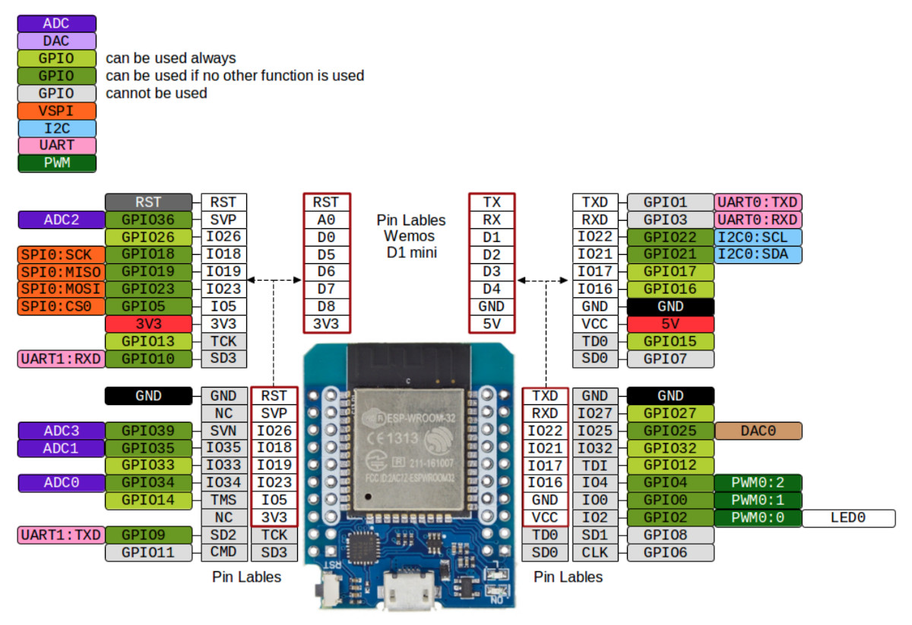

# LedCoA_ESP32 - LED Strips Control Automation via 2x ESP32 D1Mini WeMos DevBoards
This application controls up to 4 LED strips from 2 synchronized ESP32 D1Mini WeMos DevBoards using 2 DACs on each board. In addition, it senses photodiodes corresponding to each of the LED strips and synchronizes LED strips blinking with the [Euresys Coaxlink Grabber (Coaxlink Quad G3, KQG13496)](https://www.euresys.com/en/Products/Frame-Grabbers/Coaxlink-series/Coaxlink-Quad-G3) that captures frames from the cameras, whose lighting is provisioned by the LED strips.

**Table of Contents**
- [Hardware documentation and drivers:](#hardware-documentation-and-drivers)
- [Build](#build)
- [Usage](#usage)
  - [Minicom for UART Reading](#minicom-for-uart-reading)
- [ESP32 Port Mapping](#esp32-port-mapping)
  - [#1 D1 Mini ESP32 WeMos](#1-d1-mini-esp32-wemos)
  - [#2 D1 Mini ESP32 WeMos](#2-d1-mini-esp32-wemos)
## Hardware documentation and drivers:
- [ESP32 tutorials](https://dronebotworkshop.com/esp32-2/)
- [Euresys Coaxlink Grabber (Coaxlink Quad G3) documentation and drivers](https://www.euresys.com/en/Support/Download-area?Series=105d06c5-6ad9-42ff-b7ce-622585ce607f)

ESP32 Pinout:


## Build
Use the [PlatformIO IDE](https://platformio.org/install/ide) extension of the [Visual Studio Code IDE](https://code.visualstudio.com/) to build and flash the firmware to ESP32 D1Mini WeMos DevBoards.

## Usage

ESP32 Boards are controllable via the UART (Serial port) from the host PC, which typically features the Euresys Coaxlink Camera Grabber.  
After flashing an ESP32 board, connect their ports as specified in the sections [ESP32 Port Mapping](#esp32-port-mapping), then use minicom (see its [configuration below](#minicom-for-uart-reading)) or other application to read from the UART output from the master board.

Connect to the master board (you can list available USB devices by `$ ls /dev/ttyUSB*`; we assume that the master board on `ttyUSB0`):
```sh
$ minicom -D /dev/ttyUSB0
Input the lighting intensity (<ledstrip_id: uint2_t> <intensity: uint8_t>
```
Open another terminal to send control signals to the master board:
```
echo -ne "\x5\xAA" > /dev/ttyUSB0
```
Then you should see in the first terminal via the minicom:
```
Transferring to wire (idMask2, intensity): 0X4 0XAA
LED strips id (mask): 0X1
Set intensity: 0XAA
```
To exit from the minicom (which is mandatory before the reflashing), press `Ctrl+A X` and select `Yes`.

### Minicom for UART Reading
Minicom can be installed by the following command:
```sh
$ sudo apt install minicom
```
Then, select the target USB port and listen to it using minicom:
```sh
$ minicom -D /dev/ttyUSB0
```
Configure the opened connection and save it as a default configuration: press `Ctrl+A O`, select `Serial port setup` and ensure the following values:
```
	E - "115200 8N1"
	F - No
```

## ESP32 Port Mapping

\#1 D1 Mini is powered by USB (and, hence, can be externally controlled and re-flashed at any time).
\#2 D1 Mini can be powered either from your dedicated power supply (3.3V DC) or from 3.3V pin of #1 D1 Mini connected to 3.3V pin (note that VCC pin accepts 5V rather than 3.3V). The ground supply of #2 D1 Mini is GND pin located near its VCC pin.

D1 Mini boards synchronization can be performed either by I2C (which are IO22=SCL0 and IO21=SDA0 by default; it might be necessary to wire also the grounds of the boards to get I2C work), or by one of the available UARTs (Serial ports), or by any custom 3 pins (e.g., IO33,  IO27, IO32).
### #1 D1 Mini ESP32 WeMos
**2 internal DACs (IO25, IO26) for Analog O/P:**
IO25  <-  1. O/P  Analog 0…3.3V  Channel Top Strip L1
IO26  <-  4. O/P  Analog 0…3.3V  Channel Bottom Strip L3U
**O/P  Digital Trigger Pulse OFF is performed from GPIO:**
IO16 (might be updated to IO32)  <- 5. O/P  Digital Trigger Pulse OFF:  0V  Pulse ON:  3.3V  Channel Top Strip L1
IO17 (might be updated to IO27)  <- 8. O/P  Digital Trigger Pulse OFF:  0V  Pulse ON:  3.3V  Channel Bottom Strip L3U
**I/P  Analog 0…3.3V:**
IO34 (VDET_1 = ADC1_6 = Arduino's ADC0)  <- 9. I/P  Analog 0…3.3V  FB Photo diode Channel Top Strip L1
IO35 (VDET_2 = ADC1_7 = Arduino's ADC1)  <- 12. I/P  Analog 0…3.3V  FB Photo diode Channel Bottom Strip L3U
Alternatively, IO27 (ADC2_7) can be used to read data from 2 distinct ADCs in parallel (ADC1_6 and ADC2_7 ). However, it will load CPU because only ADC1 supports DMA.

### #2 D1 Mini ESP32 WeMos
**2 internal DACs (IO25, IO26) for Analog O/P:**
IO25  <-  2. O/P  Analog 0…3.3V  Channel Middle Strip L2S
IO26  <-  3. O/P  Analog 0…3.3V  Channel Middle Strip L3S
**O/P  Digital Trigger Pulse OFF is performed from GPIO:**
IO16 (updating to IO32)  <- 6. O/P  Digital Trigger Pulse OFF:  0V  Pulse ON:  3.3V  Channel Middle Strip L2S
IO17 (updating to IO27)  <- 7. O/P  Digital Trigger Pulse OFF:  0V  Pulse ON:  3.3V  Channel Middle Strip L3S
**I/P  Analog 0…3.3V:**
IO34 (VDET_1 = ADC1_6 = Arduino's ADC0)  <- 10. I/P  Analog 0…3.3V  FB Photo diode Channel Middle Strip L2S
IO35 (VDET_2 = ADC1_7 = Arduino's ADC1)  <- 11. I/P  Analog 0…3.3V  FB Photo diode Channel Middle Strip L3S
Alternatively, IO27 (ADC2_7) can be used to read data from 2 distinct ADCs in parallel (ADC1_6 and ADC2_7 ). However, it will load CPU because only ADC1 supports DMA.
